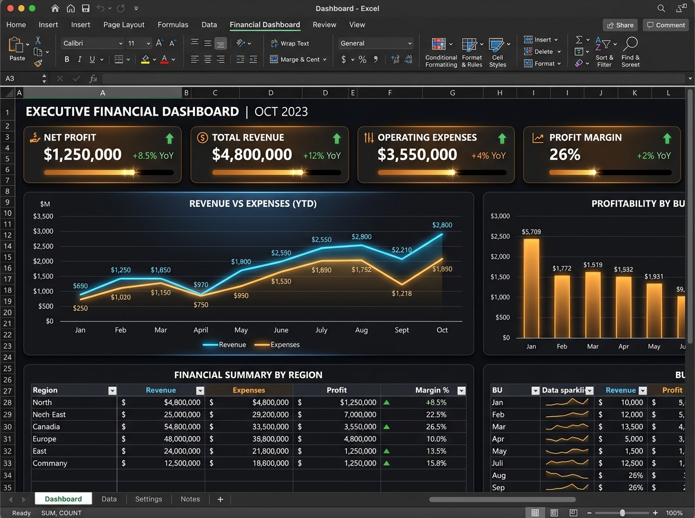
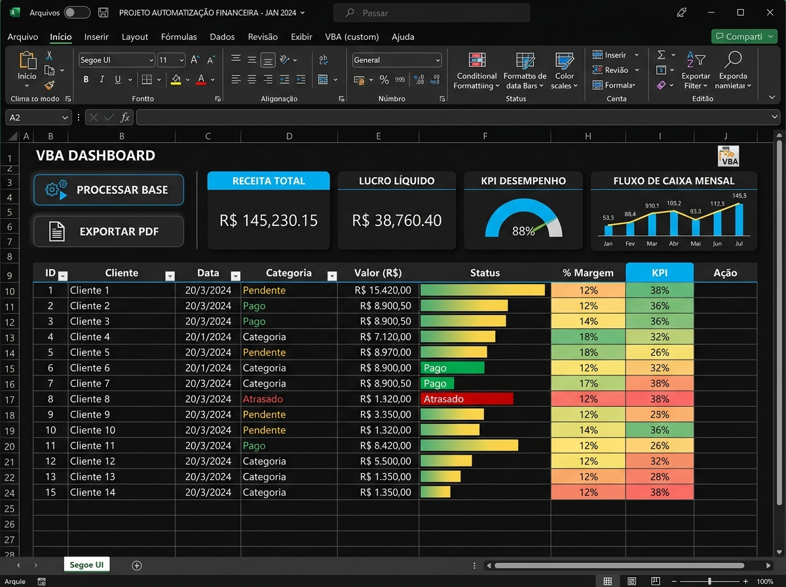
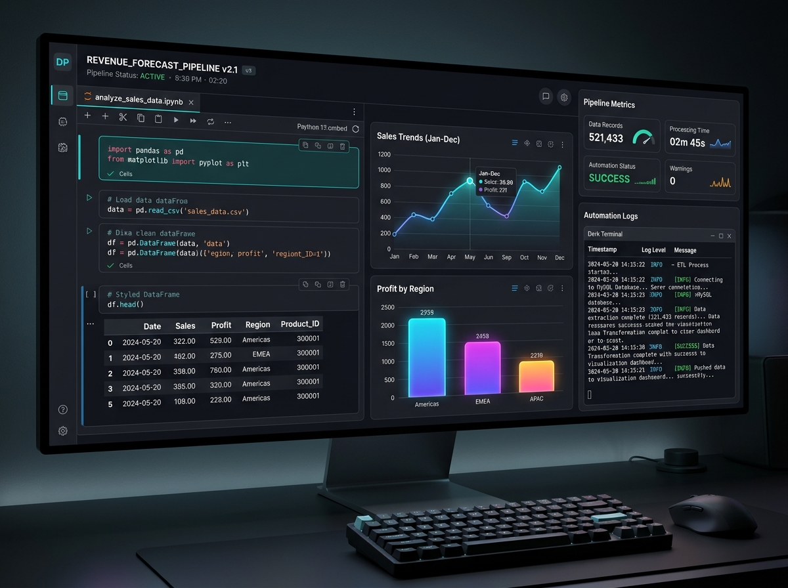
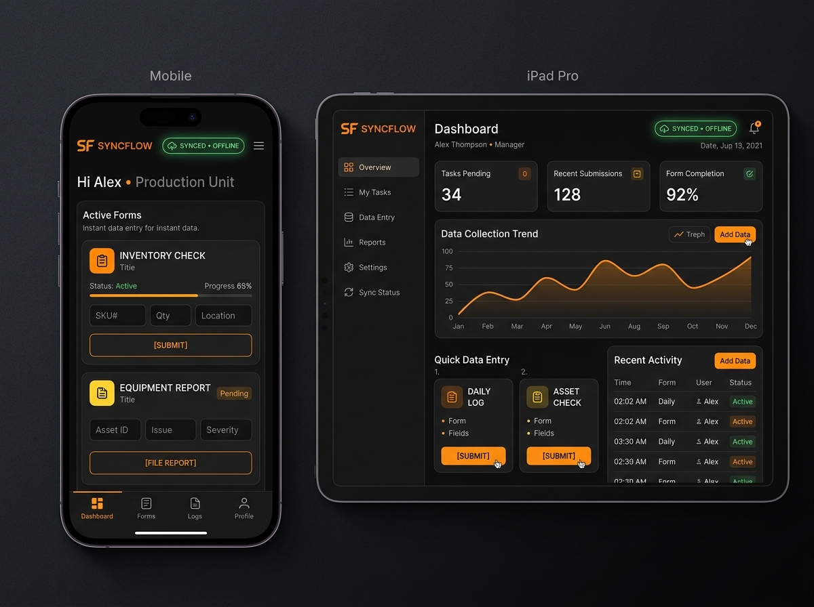
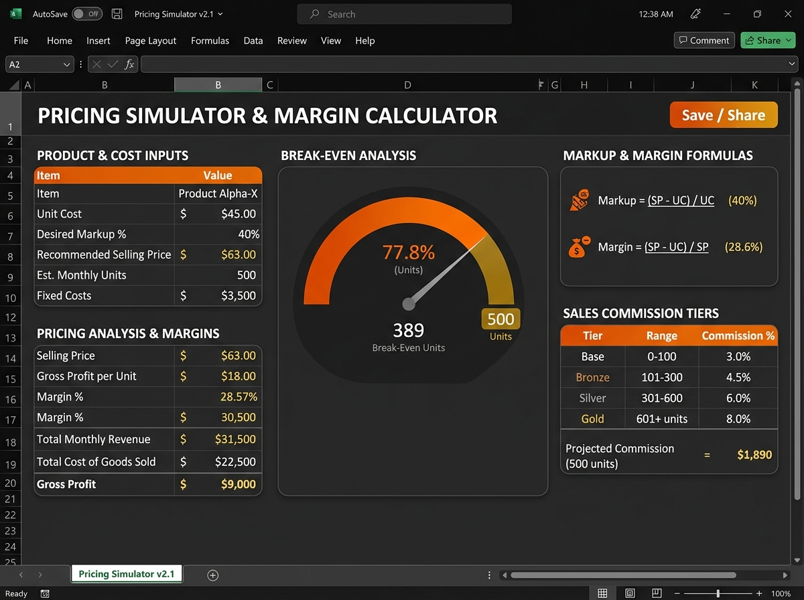
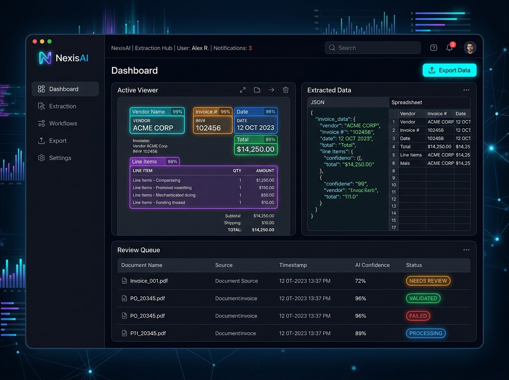

# 📊 Análise de Dados — Dashboards, Planilhas e PWAs

> **Dashboards, Planilhas e PWAs criados para projetos de Análise de Dados**  
> Desenvolvido por **Gil Lemos** ([@gillemosai](https://gillemosai.com)) — Especialista em IA Aplicada, Embaixador Copilot na CAIXA e UX Designer certificado pelo Google.

---

## 📌 Visão Geral do Repositório

Este repositório reúne projetos profissionais de **Engenharia e Análise de Dados**, **Modelagem Financeira em Excel**, **Automações com Macros VBA e Python** e **Sistemas Operacionais PWA (Progressive Web Apps)** voltados para negócios reais.

---

## 🚀 Projeto Inicial em Destaque

### 📈 ProjetoDIO3_melhorado.xlsx
O arquivo **[`ProjetoDIO3_melhorado.xlsx`](./ProjetoDIO3_melhorado.xlsx)** é um projeto completo de análise e visualização de dados desenvolvido no Microsoft Excel, com arquitetura em camadas estruturadas:

- **`Dashboard`**: Painel executivo interativo com cartões de KPIs principais, gráficos analíticos e filtros dinâmicos de alta velocidade.
- **`Calculos`**: Área de processamento com modelagem de fórmulas, indicadores estatísticos e métricas consolidadas.
- **`Tabelas_Dinamicas`**: Estrutura analítica para cruzamento multidimensional de dados e agregações segmentadas.
- **`Suporte`**: Matrizes de parâmetros, listas de validação de dados e parâmetros de apoio ao dashboard.
- **`Base_Dados`**: Repositório central de registros higienizados e tipados prontos para auditoria.

---

## 🔄 Em Breve: Novos Projetos neste Repositório

Novos projetos e soluções já estão sendo preparados e serão disponibilizados neste repositório em breve:

1. **Dashboard Financeiro Executivo & DRE Automatizada**:
   - Modelagem de fluxo de caixa diário, DRE gerencial completa, EBITDA e conciliação bancária via Macros VBA em 1 clique.
   

2. **Pipeline de Automação e ETL com Python (Pandas)**:
   - Scripts para ingestão, limpeza e tratamento de bases com mais de 500.000 linhas e geração agendada de relatórios executivos em PDF.
   

3. **Sistema PWA de Coleta Operacional (Offline-First)**:
   - Aplicativo web progressivo para entrada de dados em celulares e tablets com sincronização automática com planilhas e bancos de dados.
   

4. **Planilha Inteligente de Precificação, Markup & Comissões**:
   - Simulador de custos diretos, impostos sobre faturamento, taxas de antecipação e metas escalonadas para equipes comerciais.
   

5. **Pipeline de Extração Inteligente de Documentos (Python + IA)**:
   - Leitura de PDFs em lote, extração automática de dados estruturados e fila de governança com validação humana.
   

---

## 🤝 Projetos, Consultoria & Freelance

Estou **aberto a novos projetos, consultorias empresariais e contratos como freelancer**.

### Como posso ajudar o seu negócio:
- **Dashboards Executivos**: Transformação de planilhas desorganizadas em painéis executivos claros para tomada de decisão.
- **Automação de Rotinas**: Eliminação de processos manuais de copiar e colar com Macros VBA e Python.
- **Engenharia & Tratamento de Dados (ETL)**: Limpeza, conciliação e cruzamento de grandes bases de dados.
- **Sistemas PWA Sob Medida**: Criação de apps leves e operacionais para equipes de campo e balcão.

---

## 📬 Contato & Canais Oficiais

- 🌐 **Site Oficial**: [gillemosai.com](https://gillemosai.com) / [gillemosai.online](https://gillemosai.online)
- 💼 **E-mail Comercial**: [comercial@gillemosai.com](mailto:comercial@gillemosai.com)
- 🔗 **LinkedIn**: [linkedin.com/in/gillemosai](https://www.linkedin.com/in/gillemosai/)
- 🎨 **Behance**: [behance.net/gillemosai](https://www.behance.net/gillemosai)
- 📸 **Instagram**: [@gillemosai](https://www.instagram.com/gillemosai/)
- 🎥 **YouTube**: [@gillemosai](https://www.youtube.com/@gillemosai)

---

  Desenvolvido por Gil Lemos · Vitória da Conquista, Bahia · Todos os direitos reservados

