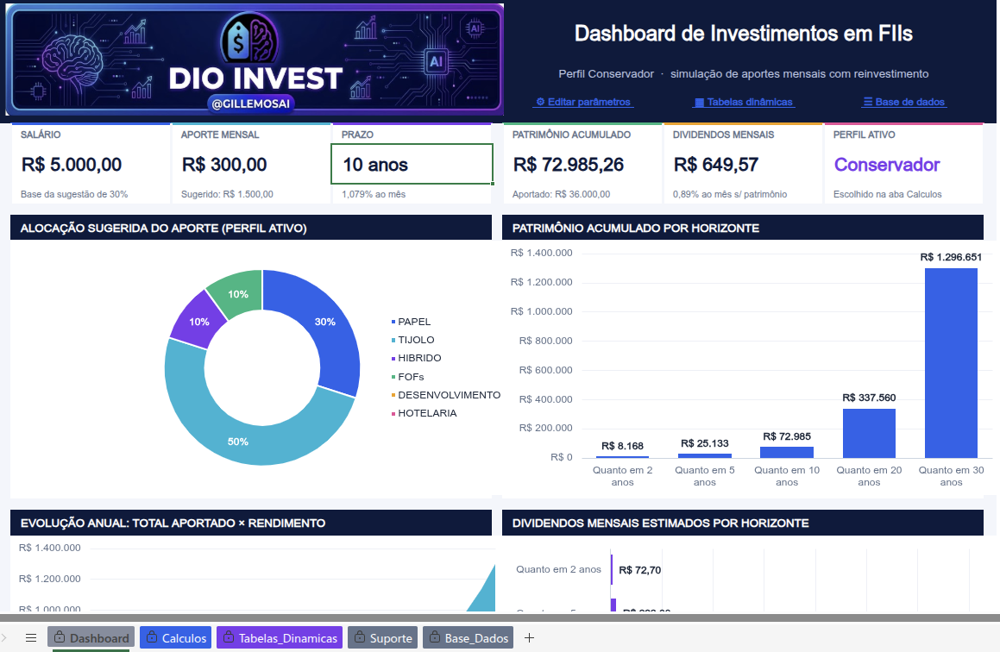
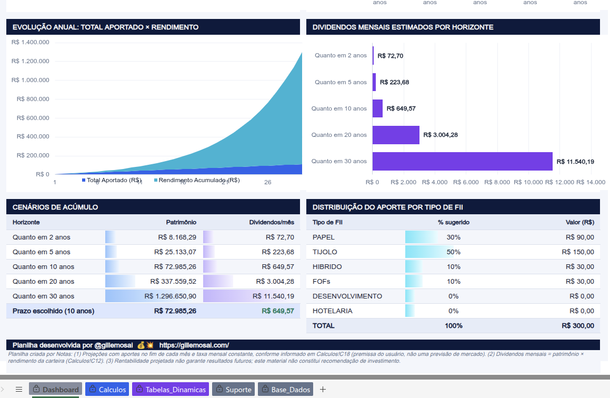
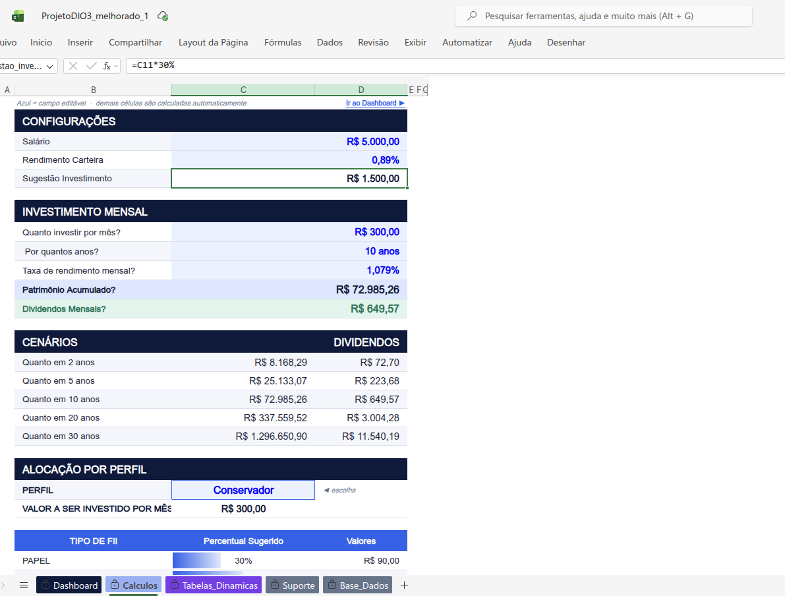
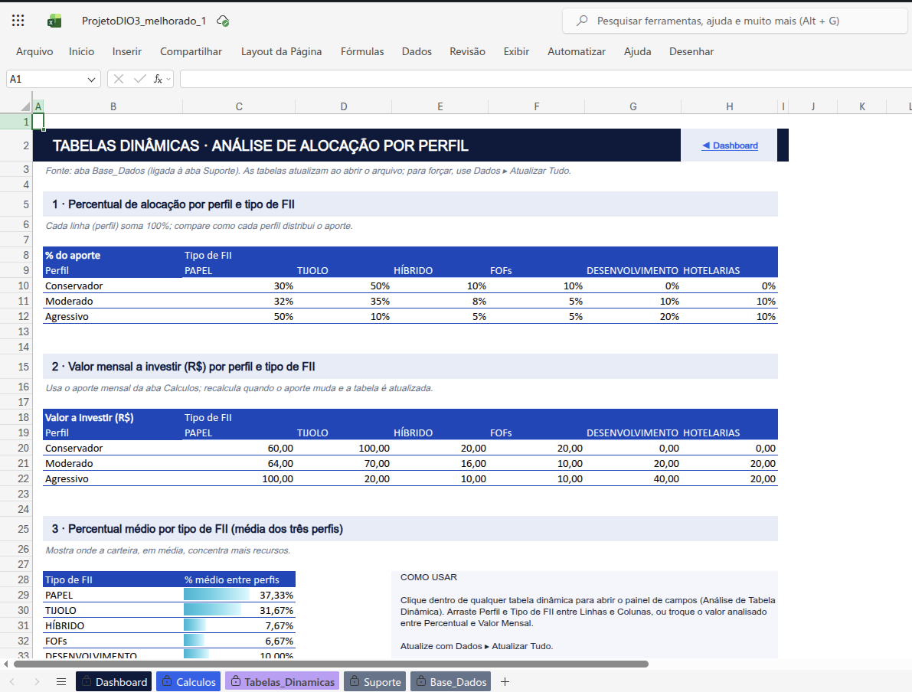
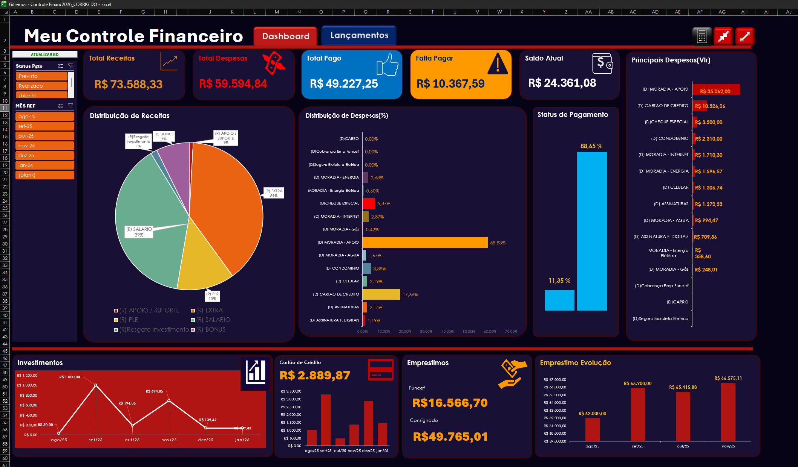
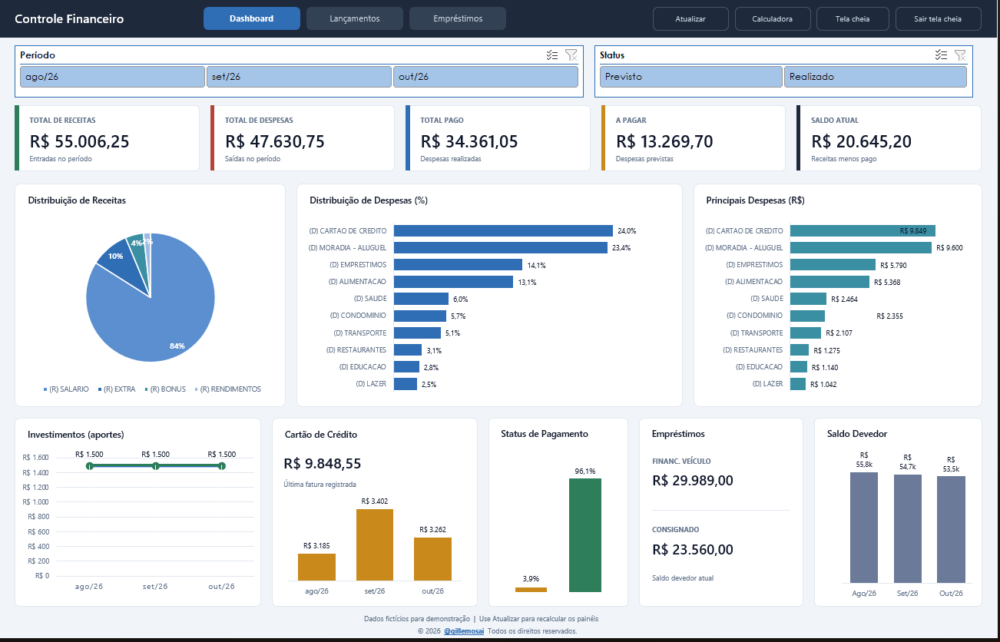
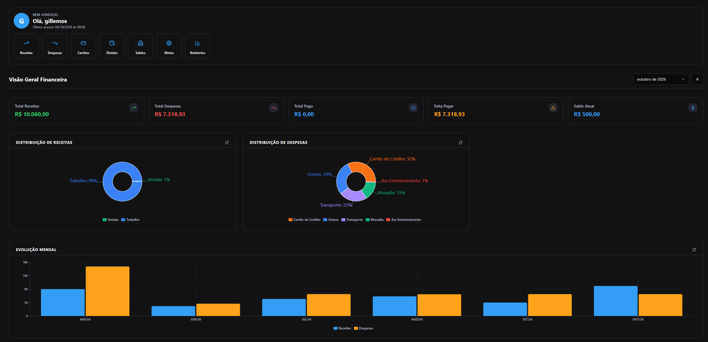
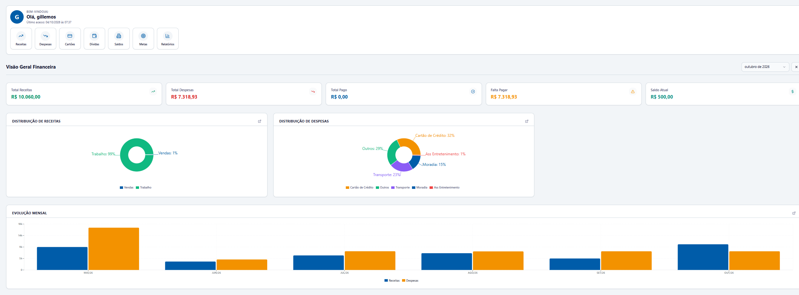
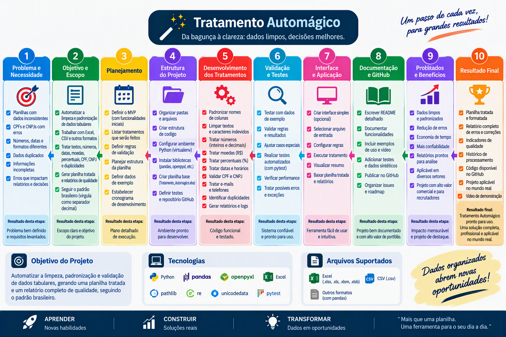

<h1 align="center">📌 Visão Geral do Repositório</h1>

Este repositório reúne projetos profissionais de **Engenharia e Análise de Dados**, **Modelagem Financeira em Excel**, **Automações com Macros VBA e Python** e **Sistemas Operacionais PWA (Progressive Web Apps)** voltados para negócios reais.

  Desenvolvido por Gil Lemos (<a href="https://gillemosai.com">@gillemosai</a>) 
  Especialista em IA Aplicada, Embaixador Copilot na CAIXA e UX Designer certificado pelo Google.

---

## 🚀 Projeto Inicial em Destaque

<h3 align="center">📈 Projeto 1/3 Bootcamp Santander/DIO - Excel com IA</h3>

  
  
  

O arquivo **[`ProjetoDIO3_melhorado.xlsx`](./ProjetoDIO3_melhorado.xlsx)** é um projeto completo de análise e visualização de dados desenvolvido no Microsoft Excel, com arquitetura em camadas estruturadas:

- **`Dashboard`**: Painel executivo interativo com cartões de KPIs principais, gráficos analíticos e filtros dinâmicos de alta velocidade.
- **`Calculos`**: Área de processamento com modelagem de fórmulas, indicadores estatísticos e métricas consolidadas.
- **`Tabelas_Dinamicas`**: Estrutura analítica para cruzamento multidimensional de dados e agregações segmentadas.
- **`Suporte`**: Matrizes de parâmetros, listas de validação de dados e parâmetros de apoio ao dashboard.
- **`Base_Dados`**: Repositório central de registros higienizados e tipados prontos para auditoria.

### 🖼️ Telas do Projeto

#### 1. Dashboard de Investimentos em FIIs — Visão Geral & KPIs

#### 2. Curva de Acúmulo, Juros Compostos & Cenários de Dividendos

#### 3. Motor de Cálculo & Parametrização Dinâmica

#### 4. Tabelas Dinâmicas & Alocação por Perfil de Risco

---

### 📥 Acesso e Download da Planilha
- 📊 **[Visualizar a Planilha no GitHub (`ProjetoDIO3_melhorado.xlsx`)](./ProjetoDIO3_melhorado.xlsx)**
- 💾 **[Download Direto do Arquivo (.xlsx)](https://raw.githubusercontent.com/gillemosai/analise_de_dados/main/ProjetoDIO3_melhorado.xlsx)**

---

## 🔄 Em Breve: Novos Projetos neste Repositório

Novos projetos e soluções já estão sendo preparados e serão disponibilizados neste repositório em breve:

<b>1. CONTROLE FINANCEIRO PESSOAL — ✅ Disponível</b>

   

     
     
     
     
     
     
   

   - Planilha com controle financeiro pessoal completo. Uso de Macros VBA, Dashboard, Tabelas Dinâmicas e Cálculos completos (todos os dados são fictícios, para demonstração).
   - 📁 **[Abrir a pasta do projeto](./controle-financeiro-pessoal/)**
   - 🛠️ **Versão Original - Feita por mim e corrigida pelo Claude Sonnet 5.5** (layout original com correção de lentidão, filtros de meses duplicados e erros `#REF!`): [Visualizar](./controle-financeiro-pessoal/Controle_Financeiro_2026_Versao_Corrigida.xlsm) · [Download direto](https://raw.githubusercontent.com/gillemosai/analise_de_dados/main/controle-financeiro-pessoal/Controle_Financeiro_2026_Versao_Corrigida.xlsm)

   

   - 🆕 **Versão Profissional** (visual sóbrio, navegação estilo aplicativo, abas protegidas): [Visualizar](./controle-financeiro-pessoal/Controle_Financeiro_2026_Modelo_Profissional.xlsm) · [Download direto](https://raw.githubusercontent.com/gillemosai/analise_de_dados/main/controle-financeiro-pessoal/Controle_Financeiro_2026_Modelo_Profissional.xlsm)

   

<b>2. Sistema PWA de controle financeiro (Offline-First) — ✅ Disponível: <a href="https://github.com/gillemosai/finanza2026">Finanza</a></b> <code>v7.7.0</code>

   

     
     
     
     
     
     
     
     
   

   - Sistema de controle financeiro **pessoal e profissional**, com dashboards inteligentes para acompanhar **receitas, despesas, dívidas, cartões e saldos bancários**. Substitui o controle em planilhas por uma interface web (PWA) rápida, limpa e já totalmente funcional, com repositório próprio.
   - 🌐 **[Acessar o app](https://gillemosai.com/apps/finanza/)** · 💎 **[Planos](https://gillemosai.com/apps/finanza/planos/)** · 📦 **[Repositório no GitHub](https://github.com/gillemosai/finanza2026)**
   - 🧭 **Módulos:** Dashboard, Receitas, Despesas, Cartões, Dívidas, Saldos Bancários, Metas, Relatórios (exportação para Excel e PDF) e Configurações.
   - ✨ **Destaques:** funciona offline (IndexedDB com sincronização automática), instalável como PWA e compilável para iOS/Android via Capacitor, tema escuro/claro, ocultar saldos, copiar o mês anterior, busca com `Ctrl+K`, importação de planilha Excel e opções de acessibilidade (texto maior, alto contraste, leitor de tela).
   - 🛠️ **Stack:** Vite · React 18 · TypeScript · Tailwind CSS · shadcn/ui · Framer Motion · Supabase (PostgreSQL, autenticação e RLS) · IndexedDB/SQLite · Capacitor · Vercel/Hostinger.
   - 📜 **Licença:** proprietária — todos os direitos reservados.

   | Dashboard (tema escuro) | Dashboard (tema claro) |
   |:-----------------------:|:----------------------:|
   |  |  |

<b>3. Automação com Python (Pandas) — 🚧 Em desenvolvimento</b>

   

     
     
     
     
     
     
     
   

   - **Tratamento Automágico** — automatização da limpeza, padronização e validação de dados tabulares (Excel, CSV e outros formatos via pandas), gerando uma planilha tratada e um relatório completo de qualidade, seguindo o padrão brasileiro (vírgula como separador decimal, moedas em R$, datas e CPF/CNPJ).
   - 🧹 **O que será feito:** padronizar nomes de colunas, limpar textos e caracteres indevidos, tratar números, moedas (R$) e percentuais (%), validar CPF e CNPJ, tratar e-mails, telefones, datas e horários, identificar duplicidades e gerar relatórios e logs.
   - 🛠️ **Tecnologias:** Python · pandas · openpyxl · pathlib · re · unicodedata · pytest.

   > ⚠️ **Observação:** este projeto está **em desenvolvimento** e ainda não foi disponibilizado neste repositório. O roteiro abaixo ilustra o que será construído.

   

---

## 🤝 Projetos, Consultoria & Freelance

Estou **aberto a novos projetos, consultorias empresariais e contratos como freelancer**.

### Como posso ajudar o seu negócio:
- **Dashboards Executivos**: Transformação de planilhas desorganizadas em painéis executivos claros para tomada de decisão.
- **Automação de Rotinas**: Eliminação de processos manuais de copiar e colar com Macros VBA e Python.
- **Engenharia & Tratamento de Dados (ETL)**: Limpeza, conciliação e cruzamento de grandes bases de dados.
- **Sistemas PWA Sob Medida**: Criação de apps leves e operacionais para equipes de campo e balcão.

---

## 📬 Contato & Canais Oficiais

- 🌐 **Site Oficial**: [gillemosai.com](https://gillemosai.com)
- 💼 **E-mail Comercial**: [comercial@gillemosai.com](mailto:comercial@gillemosai.com)
- 🔗 **LinkedIn**: [linkedin.com/in/gillemosai](https://www.linkedin.com/in/gillemosai/)
- 🎨 **Behance**: [behance.net/gillemosai](https://www.behance.net/gillemosai)
- 📸 **Instagram**: [@gillemosai](https://www.instagram.com/gillemosai/)
- 🎥 **YouTube**: [@gillemosai](https://www.youtube.com/@gillemosai)

---

  Desenvolvido por Gil Lemos · Vitória da Conquista, Bahia · Todos os direitos reservados

