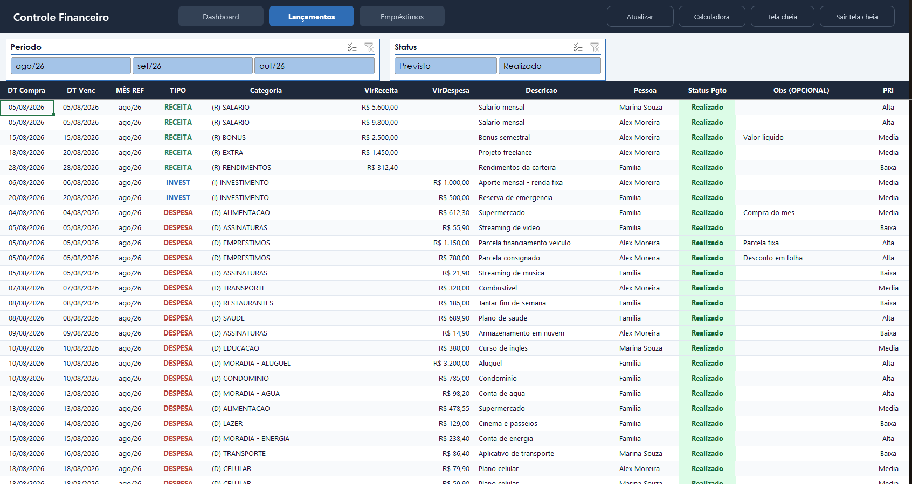
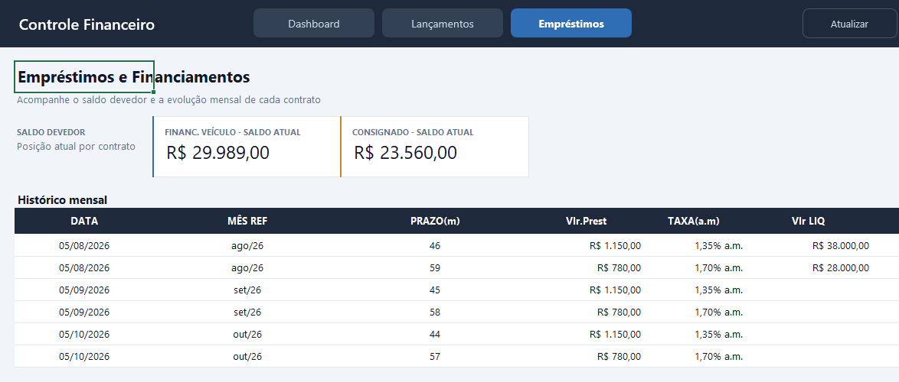
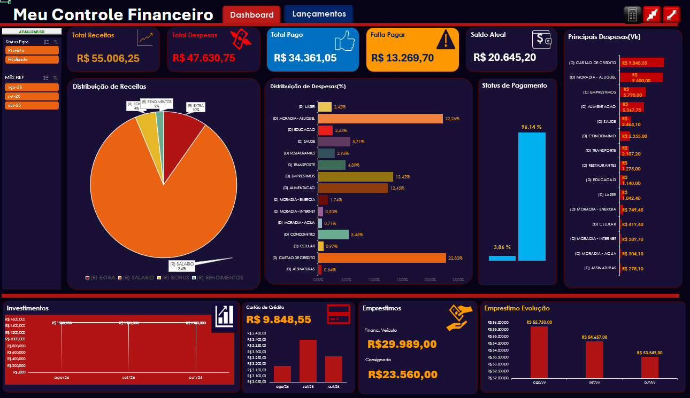

# 💰 Controle Financeiro Pessoal (Excel + VBA)

#### Projeto criado e corrigido com Excel 365 + VBA no Windows 11

  
  
  
  
  
  

Planilha de controle financeiro pessoal com **Dashboard interativo**, **Tabelas Dinâmicas**, **Segmentações de dados** e **Macros VBA**.

> ⚠️ Todos os dados contidos nos arquivos são **fictícios** e servem apenas para demonstração (períodos de ago/26 a out/26).

## 📦 Versões disponíveis

| Versão | Arquivo | Descrição |
|---|---|---|
| 🆕 **Profissional** | [`Controle_Financeiro_2026_Modelo_Profissional.xlsm`](./Controle_Financeiro_2026_Modelo_Profissional.xlsm) | Visual sóbrio e moderno, barra de navegação, filtros por período e status, abas técnicas ocultas, dashboard protegido e atualização automática ao abrir. |
| 🛠️ **Corrigida** | [`Controle_Financeiro_2026_Versao_Corrigida.xlsm`](./Controle_Financeiro_2026_Versao_Corrigida.xlsm) | Layout original (tema escuro) com as correções de desempenho, meses duplicados no filtro e erros `#REF!`. |

## ✨ O que o projeto entrega

- **Dashboard** com indicadores de receitas, despesas, total pago, a pagar e saldo.
- **Gráficos analíticos**: distribuição de receitas e despesas, principais despesas, investimentos, cartão de crédito, status de pagamento e saldo devedor de empréstimos.
- **Lançamentos**: tabela com validação de dados, status colorido (Realizado / Previsto / vencido) e coluna de mês calculada automaticamente.
- **Empréstimos**: histórico mensal e saldo devedor por contrato.
- **Macros VBA**: atualização dos painéis, calculadora e modo tela cheia.

## 🖼️ Telas

## ▶️ Como usar

1. Baixe o arquivo `.xlsm` e abra no **Microsoft Excel 365**.
2. Clique em **Habilitar conteúdo / Macros** quando o Excel solicitar.
3. Registre seus lançamentos na aba **Lançamentos** (digite na linha logo abaixo da tabela).
4. Use o botão **Atualizar** para recalcular os painéis.

## 🔒 Observações

- A proteção do dashboard não possui senha (Revisão › Desproteger Planilha).
- As abas **Lançamentos** e **Empréstimos** ficam desprotegidas para permitir o cadastro de novas linhas.

---

  © 2026 <a href="https://gillemosai.com">@gillemosai</a> · Todos os direitos reservados.

